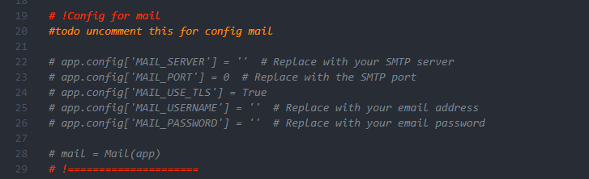
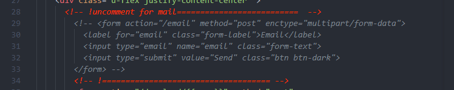

# InCode
En|CO|De is API for encryption and decoding images(steganography), builded on the base of Flask framework

## Installation
    1. Clone this repository
    2. Create virtual environment
    3. Install requirements.txt
    4. In main.py, line 136 remove app.run(debug=True) and uncomment app.run()
    4. Run main.py
    5. Open in browser http://

## Usage
    Write data for your SMTP in connection line in main.py(lines: 19-30, 114-131)
    Remove in the end of main.py debug=True
    You always can rewrite your own logic for encryption and decode into the file steganography.py
    It use Bootstrap v5.3 connection line and classes

## Usage for MAIL
    In main.py uncomment lines 26-30 and write your own data for SMTP

    
    in templates/encrypted.html 

    and upper in the same file in line 22 change description for your own

## Todo
    rewrite for vite front with react