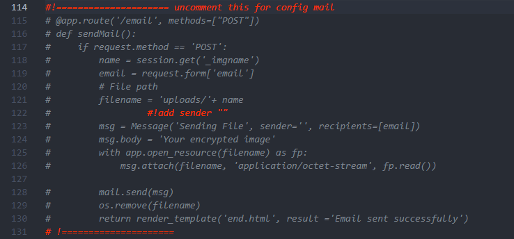

# InCode
En|CO|De is API for encryption and decoding images(steganography), builded on the base of Flask framework

## Installation
    1. Clone this repository
    2. Create virtual environment
    3. Install requirements.txt
    4. Run main.py
    5. Open in browser http://

## Used libraries
    blinker==1.7.0
    cffi==1.16.0
    click==8.1.7
    cryptography==42.0.0
    Flask==3.0.1
    Flask-Mail==0.9.1
    itsdangerous==2.1.2
    Jinja2==3.1.3
    MarkupSafe==2.1.4
    pillow==10.2.0
    pycparser==2.21
    Werkzeug==3.0.1

## Usage for MAIL
    Write data for your SMTP in connection line in main.py(lines: 21-30, 152-171)
    You always can rewrite your own logic for encryption and decode into the file steganography.py

    in templates/encrypted.html 

    and upper in the same file in line 22 change description for your own

## Todo
    add js(ts)
    rewrite for vite front with react
    more design
    